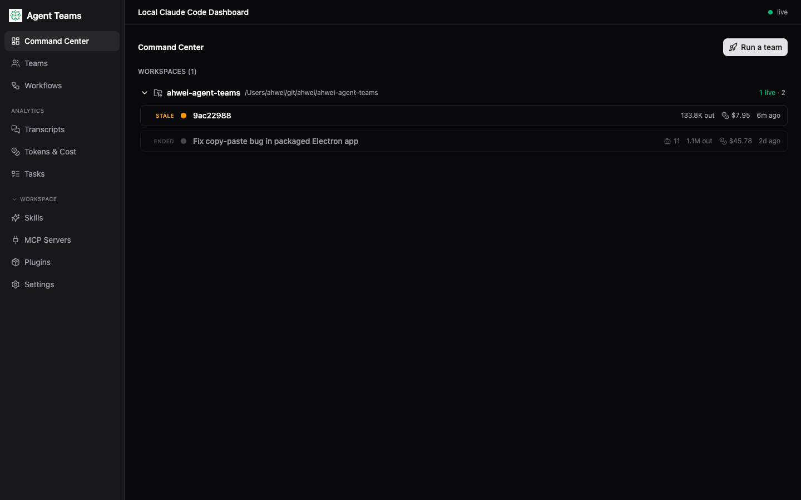
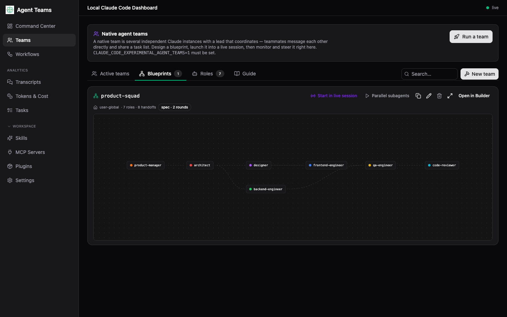
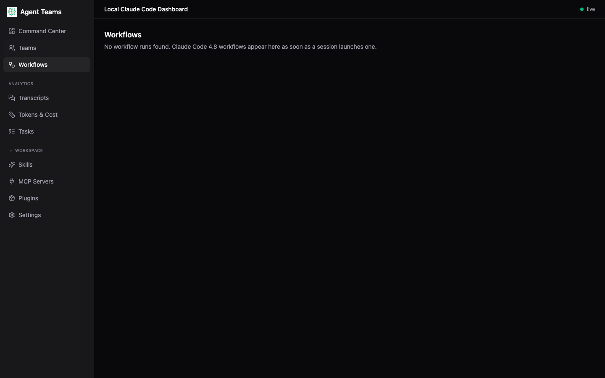
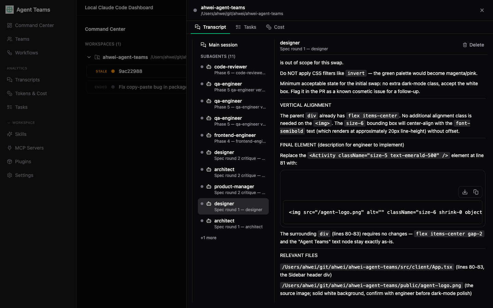
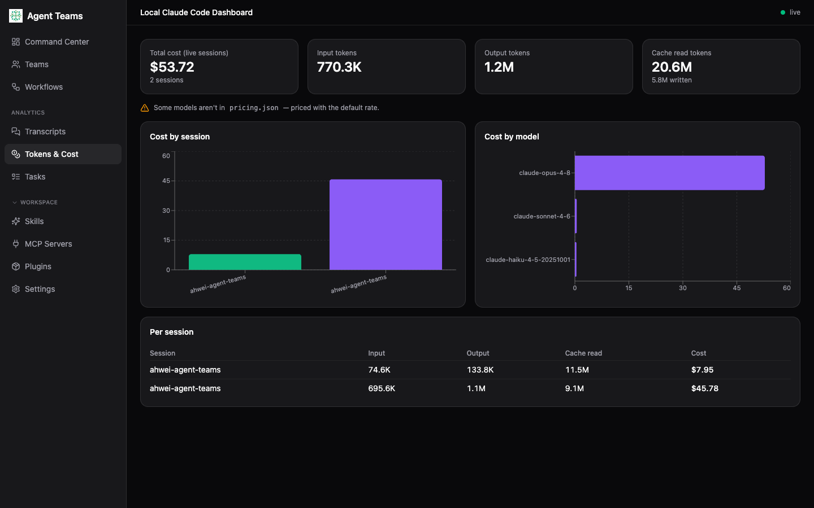
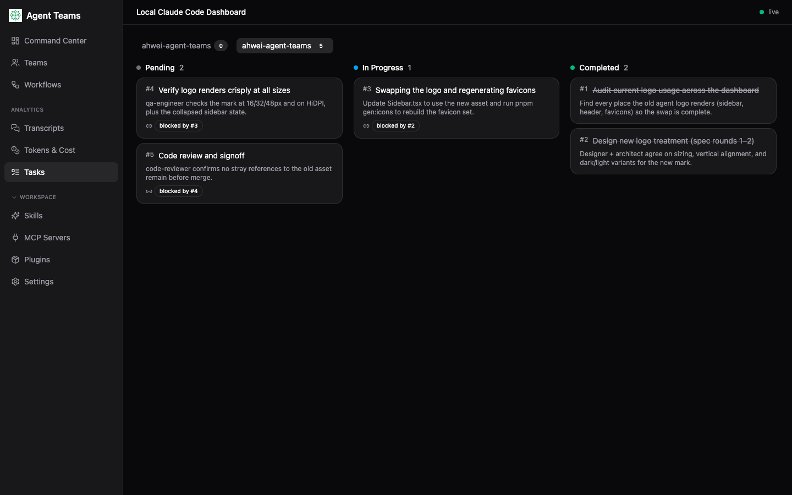
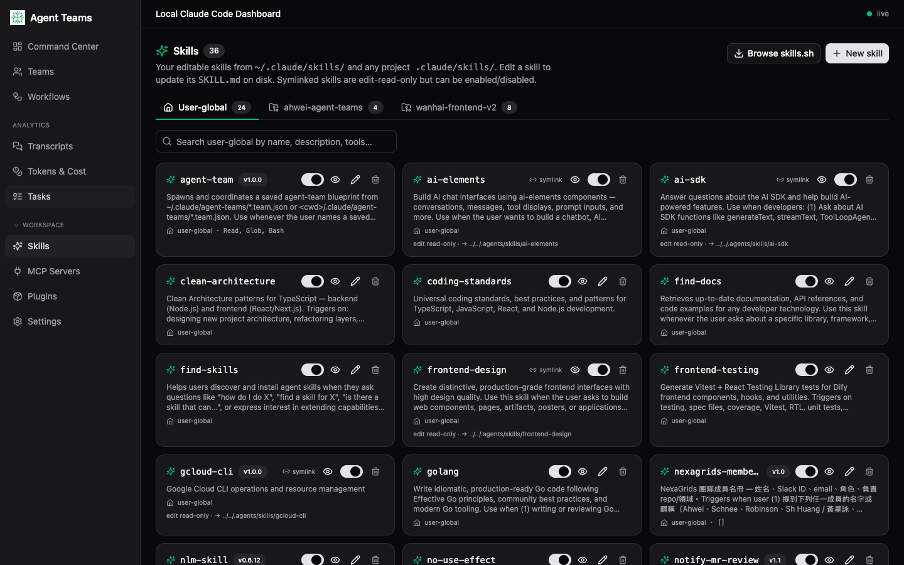
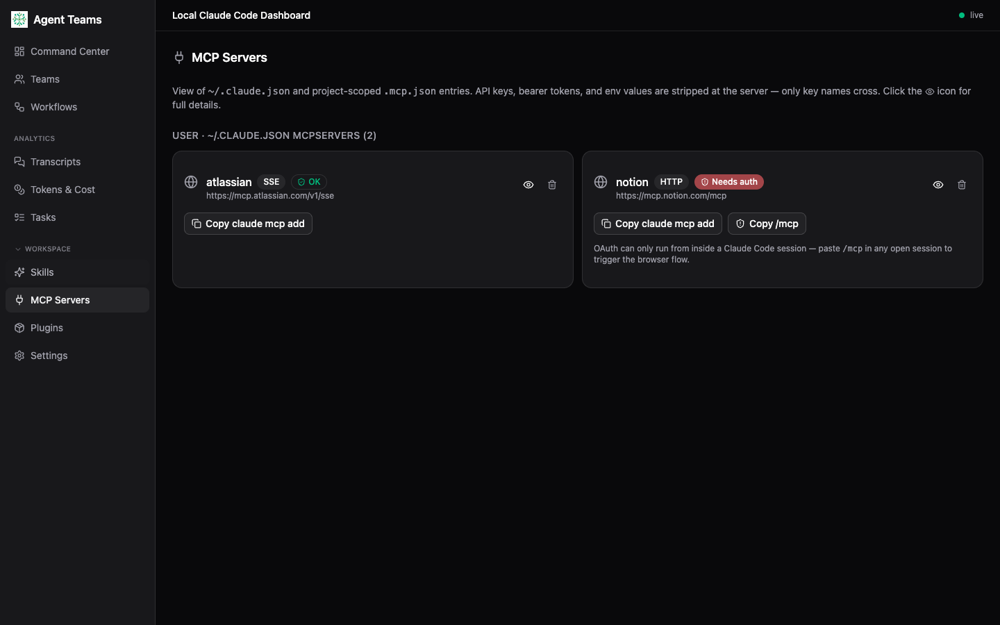
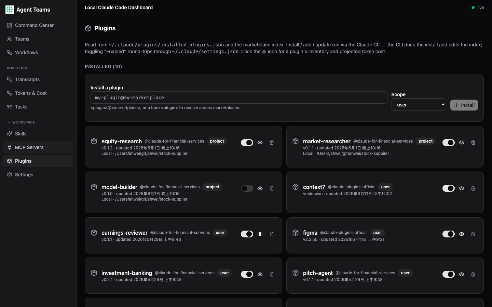
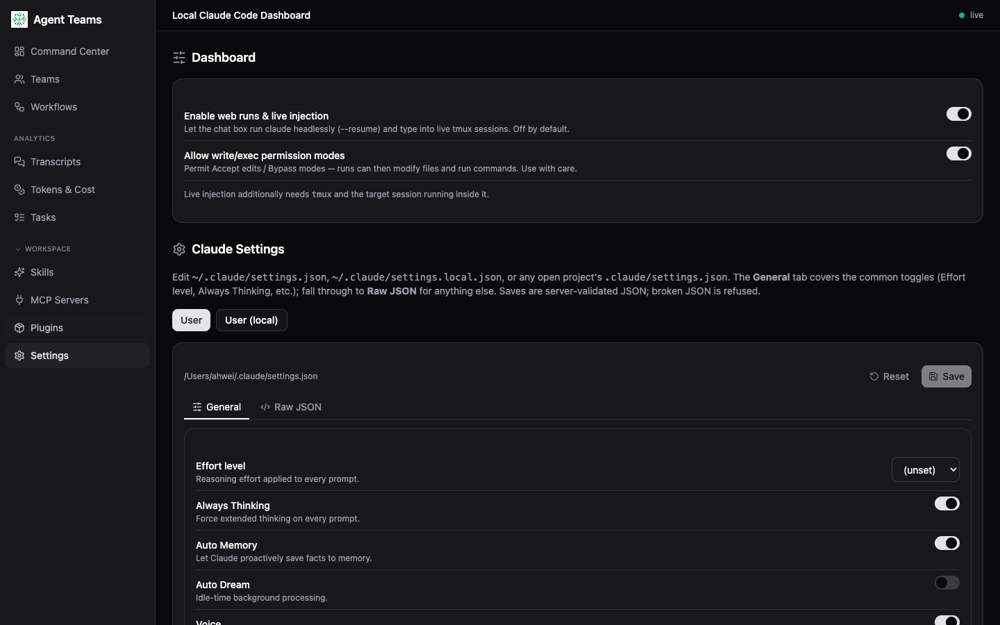

# Agent Teams 使用手冊

Agent Teams 是一個在你自己電腦上執行的**唯讀**桌面儀表板，用來即時觀察
[Claude Code](https://claude.ai/code) 的工作階段（session）以及它們所派生的
agent 團隊——狀態、對話記錄、Token／成本、任務看板等等。所有資料都直接讀取你本機的
`~/.claude` 目錄，**不會上傳任何東西**；即使開啟瀏覽器模式，內建伺服器也只綁定
`127.0.0.1`（loopback），其他裝置無法連入。

> 技術上它是一個 **Tauri v2** 應用程式：由 **Rust 核心**負責監看檔案系統，畫面則是
> 跑在原生視窗裡的 React 介面，兩者透過原生 IPC 溝通。它**不是** Web／雲端服務，也不再
> 內含 Node／Express 伺服器或 Electron 外殼。

本手冊逐頁說明每個畫面的用途與重點。安裝方式請見 [README](../README.md)。

---

## 目錄

- [介面總覽](#介面總覽)
- [1. Command Center 指揮中心](#1-command-center-指揮中心)
- [2. Teams 團隊](#2-teams-團隊)
- [3. Workflows 工作流程](#3-workflows-工作流程)
- [4. Transcripts 對話記錄](#4-transcripts-對話記錄)
- [5. Tokens & Cost 用量與成本](#5-tokens--cost-用量與成本)
- [6. Tasks 任務看板](#6-tasks-任務看板)
- [7. Skills 技能](#7-skills-技能)
- [8. MCP Servers](#8-mcp-servers)
- [9. Plugins 外掛](#9-plugins-外掛)
- [10. Settings 設定](#10-settings-設定)
- [在瀏覽器中使用（本機 Web 模式）](#在瀏覽器中使用本機-web-模式)
- [從儀表板送出提示（選用，預設關閉）](#從儀表板送出提示選用預設關閉)
- [隱私與安全](#隱私與安全)

---

## 介面總覽

左側是固定的導覽列，分成三組：

- **上方（即時操作）**：Command Center、Teams、Workflows——你正在進行中的工作。
- **Analytics（跨階段彙總）**：Transcripts、Tokens & Cost、Tasks。
- **Workspace（工作區設定，可收合）**：Skills、MCP Servers、Plugins、Settings。

右上角的綠點與 `live` 字樣代表儀表板與本機核心的連線狀態（`live` / `connecting` /
`disconnected`）。

---

## 1. Command Center 指揮中心

進入 App 的第一個畫面。它把所有 Claude Code 工作階段依**工作目錄（workspace）**分組，
每個 session 列出：

- **存活狀態**：`live`（執行中）／`stale`（一段時間沒有活動）／`ended`（已結束）等小圓點與標籤。
- **Session 短碼**或由首則提示推導出的標題（例如上圖的「Fix copy-paste bug in packaged Electron app」）。
- **派生的 subagent 數量**（例如 `11`）、累積的 **output token** 與**花費金額**，以及最後活動時間。

右上角的 **Run a team** 可直接從這裡啟動一個已儲存的團隊藍圖。

---

## 2. Teams 團隊

管理「native agent team」——由一位 lead 協調多個獨立 Claude 實例、彼此直接傳訊並共用一份
任務清單。畫面分成數個分頁：

- **Active teams**：目前正在執行的 native 團隊（需設定 `CLAUDE_CODE_EXPERIMENTAL_AGENT_TEAMS=1`）。
- **Blueprints**：你設計好、可重複使用的團隊藍圖。上圖的 `product-squad` 以**流程圖**呈現
  各角色與交接關係（7 roles · 8 handoffs）：product-manager → architect → designer／
  backend-engineer／frontend-engineer → qa-engineer → code-reviewer。可按
  **Start in live session**、**Parallel subagents** 或 **Open in Builder** 進一步操作。
- **Roles**：藍圖中用到的各個角色定義。
- **Guide**：啟用與建立團隊的逐步說明。

---

## 3. Workflows 工作流程

顯示 Claude Code 的 workflow 執行紀錄。只要有 session 啟動 workflow，這裡就會即時列出對應的
執行樹與各階段狀態；尚未有任何 workflow 時則顯示空狀態提示（如上圖）。

---

## 4. Transcripts 對話記錄

三欄式的對話檢視器：左欄選 session，中欄是 **agent 樹**（`Main session` 加上所有 subagent），
右欄是事件串流。上圖點開了一個有 **11 個 subagent** 的 `product-squad` 執行，並進一步點選其中的
`designer` subagent，右側即顯示**該 subagent 自己的對話內容**（設計規格、相關檔案、程式片段等）。

- 每個工具呼叫（Bash、編輯等）都會以可展開的列呈現，並標示 `Running` / `Completed` / `Error`。
- 對於執行中的 session，新內容會即時串流進來。

---

## 5. Tokens & Cost 用量與成本

把每個 session 與每個模型的用量與花費整理成圖表：

- 上方四張卡片：**總花費**、**input／output token**、**cache read token**。
- **Cost by session**、**Cost by model** 長條圖，以及最下方逐筆的 **Per session** 表格。
- 價格來自 `pricing.json`（每百萬 token 的美元單價）。你可以在 `~/.claude/pricing.json`
  放自己的版本覆寫，App 會**即時熱更新**重新計價，不需重啟。若某個模型不在價目表中，會以
  預設費率計算並顯示提示。

---

## 6. Tasks 任務看板

以 **Pending／In Progress／Completed** 三欄看板呈現某個 session 的任務，上方分頁可切換 session。
每張卡片顯示任務編號、標題、說明，以及**相依關係**標籤（例如 `blocked by #3`），讓你一眼看出
哪些任務正在等待前置任務完成。

---

## 7. Skills 技能

瀏覽並管理你的 Claude Code 技能（skills）。可以：

- 從 [skills.sh](https://skills.sh) 瀏覽與安裝技能（右上角 **Browse skills**）。
- 用開關**啟用／停用**某個技能的模型自動呼叫。
- 直接在此編輯本機的 `SKILL.md`，或刪除技能。
- 以分頁區分 **User-global**（`~/.claude/skills`）與各專案（`<cwd>/.claude/skills`）的技能。

---

## 8. MCP Servers

檢視 `~/.claude.json` 與各專案 `.mcp.json` 中設定的 MCP 伺服器。每張卡片顯示名稱、傳輸方式
（SSE／HTTP…）與**即時健康狀態**（`OK` / `Needs auth`）。

- 提供 **Copy `claude mcp add`** 等指令，方便你快速複製設定。
- **重要安全性**：API key、bearer token 與環境變數的**值**都在伺服器端就被去除，只有 key 名稱
  會傳到畫面——機密不會外流。

---

## 9. Plugins 外掛

管理已安裝的外掛與 marketplace。以格狀列出每個外掛（名稱、來源、scope），可用開關啟用／停用，
也可從上方輸入外掛 id 進行安裝；點進去可看到該外掛的元件清單與預估 token 成本。

---

## 10. Settings 設定

分成兩個區塊：

- **Dashboard**：儀表板自身的開關，包括 **Enable web runs & live injection**（讓聊天框能以
  `--resume` 無頭執行 claude 或注入到 live session，**預設關閉**）與 **Allow write/exec
  permission modes**。詳見下方說明。
- **Claude Settings**：直接編輯 `~/.claude/settings.json`、`settings.local.json` 或某個開啟中
  專案的 `.claude/settings.json`。**General** 分頁提供常用開關（Effort level、Always Thinking、
  Auto Memory…），其餘設定可切到 **Raw JSON**。存檔時會驗證 JSON，格式錯誤會被拒絕。

---

## 在瀏覽器中使用（本機 Web 模式）

除了桌面視窗，同一套儀表板也能在一般瀏覽器分頁中開啟——資料與功能完全相同，由 Rust 核心內建的
小型 HTTP/WS 伺服器提供。它**只綁定 `127.0.0.1`**，並會拒絕非 loopback 的 `Host`/`Origin`
請求，因此惡意網頁也無法連入。

- **從安裝好的桌面 App（免終端機）**：開啟 **Settings → Dashboard → 「Serve dashboard to
  browser」**，它會立刻啟動 loopback 伺服器並顯示網址，選擇也會被記住。
- 進階使用者也可以用內建的無頭模式在終端機啟動（細節見原始碼專案）。

Web 版與桌面版功能對等，包含同樣**預設關閉、需手動開啟**的寫入路徑——瀏覽器版不會放寬任何權限。

---

## 從儀表板送出提示（選用，預設關閉）

預設情況下 App 完全唯讀。你可以選擇開啟讓對話框的輸入直接「打字進」一個正在執行的 session——
文字會出現在你真正的終端機裡，就像你親手輸入一樣。後端會自動偵測（介面操作方式都一樣）：

- **iTerm2**：透過 AppleScript 比對 session 的 tty 驅動，不需 tmux。
- **Terminal.app**：macOS 內建終端機，同樣以 AppleScript 驅動。
- **tmux**：以 `tmux send-keys` 注入到對應 pane，**任何**終端機（包含 VS Code 內建終端機）只要
  在 tmux 裡啟動 claude 就能被注入。

在 **Settings → Dashboard → 「Enable web runs & live injection」**啟用即可，選擇會記在
`~/.claude/agent-teams-dashboard.json`，正常雙擊開啟也有效。

---

## 隱私與安全

- **唯讀為原則**：核心只讀取 `~/.claude`，僅有少數**明確、預設關閉**的寫入路徑（編輯技能／
  agent／團隊藍圖／設定，以及——預設關閉的——無頭執行 claude 或注入 live session）。一般絕不會
  改動你的 session、對話記錄或任務。
- **不上傳**：所有運算都在本機完成；瀏覽器模式僅限 `127.0.0.1`，沒有遠端／區網存取，也沒有帳號登入。
- **機密自動去除**：MCP 環境變數／header 的值、IDE lock 的 token 等都在掃描階段就被丟棄，不會出現在
  畫面或任何紀錄中。

---

_本手冊中的截圖以示範資料呈現。實際畫面會反映你自己 `~/.claude` 中的 session 與設定。_
